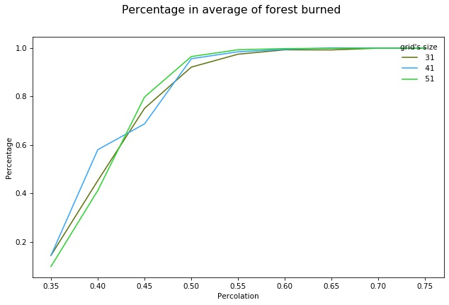

# Automate Cellulaire
## Travail Pratique sur le feu de forêt
**Propriétés:**
1. 4 états (vide, cendre, forêt, feu) 
2. Voisinage de Moore

**Règles:**
1. si au moins un voisin est en feu alors devient feu
2. si feu alors devient cendre

**Percolation:**
La percolation est un processus physique critique qui décrit pour un système, une transition d’un état vers un autre (wikipedia).
### Exemple d'une simulation

### Analyse statistique
**Conditions:**
Pourcentage réalisé sur 5 échantillons de tailles et de valeurs de densité(percolation) différentes.

